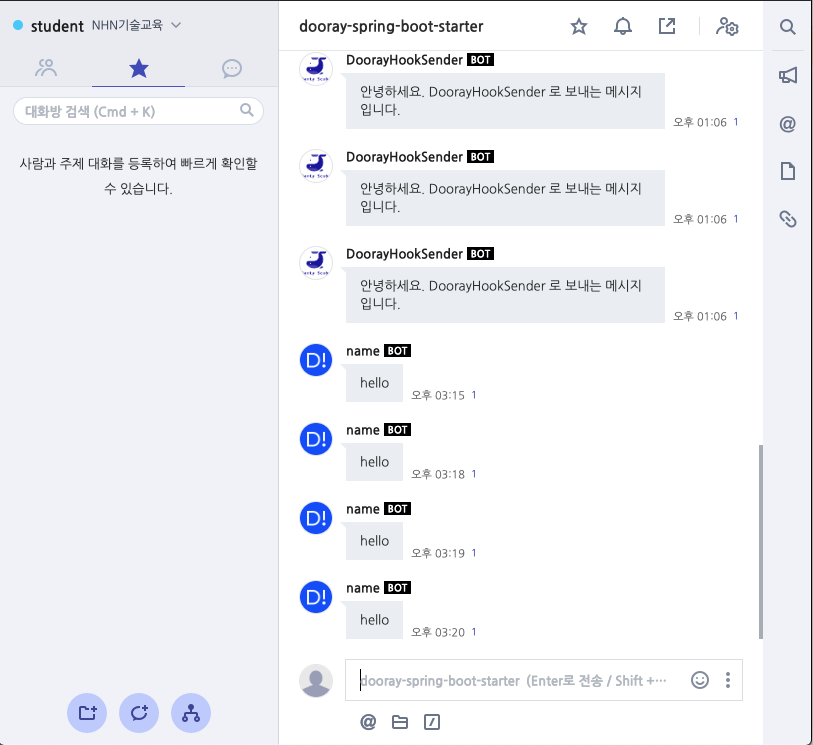

***********************************************
dooray-spring-boot-starter-application 의 실행
***********************************************

애플리케이션이 실행하면서 Hook 발송
==================================================================

* /dooray-spring-boot-starter-application/src/main/java/com/nhn/edu/springboot/starter/Application.java 을 실행합니다.

메시지 수신
==================================================================

* 코드에서 DoorayHook 으로 작성한 내용이 Dooray! 메신저에 표시됩니다.

